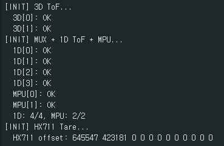
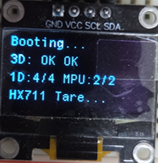
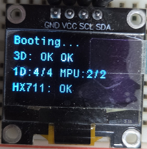
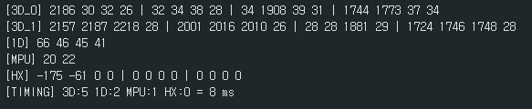
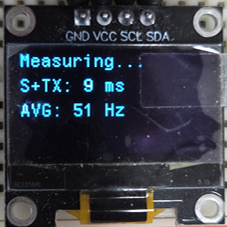

# SmartChair-STM32

**SPCC (Smart Posture Correction Chair)** — STM32F411CEU6 펌웨어

스마트 자세 교정 의자의 센서 노드 펌웨어입니다. 4종 20개 센서를 50Hz로 실시간 수집하여 Raspberry Pi 5에 UART로 전송합니다.

## 센서 구성

| 센서 | 수량 | 통신 | 용도 |
|------|------|------|------|
| VL53L8CX | 2 | SPI (3.125MHz) | 거북목 3D 거리 측정 |
| VL53L0X | 4 | I2C (MUX CH2~5) | 요추 척추 굽힘 측정 |
| MPU6050 | 2 | I2C (MUX CH6~7) | 의자 기울기 보정 |
| HX711 | 12 | GPIO 비트뱅잉 | 압력(하중) 측정 |

## 동작 흐름

```
전원 ON → 센서 초기화 → RPi5 핸드셰이크(READY/ACK/LINK_OK)
    → CHK_SIT 대기 → 착석 감지 → CAL 또는 GO
        → CAL: 500프레임 캘리브레이션 → CAL_DONE → CHK_SIT 복귀
        → GO:  50Hz 센서 수집 루프 → 129B 패킷 UART 전송
            → STAND(5초 이탈) 또는 STOP/QUIT → CHK_SIT 복귀
```

## 패킷 구조 (129 bytes, packed)

| 필드 | 크기 | 타입 | 설명 |
|------|------|------|------|
| header | 4B | char[4] | `DAT:` or `CAL:` |
| hx711 | 48B | int32 x12 | 로드셀 12채널 |
| tof3d | 64B | uint16 x32 | 3D ToF 4x4존 x2 |
| tof1d | 8B | uint16 x4 | 1D ToF 4채널 (mm) |
| mpu | 4B | int16 x2 | pitch 각도 (°) |
| checksum | 1B | uint8 | XOR |

## 실행 화면

### 센서 초기화

시리얼 모니터 (115200 baud)와 OLED를 통해 초기화 결과를 확인할 수 있습니다.

| 시리얼 모니터 초기화 로그 | OLED 초기화 표시 |
|:---:|:---:|
|  |   |

### 실시간 센서 데이터 수집

50Hz 루프에서 4종 센서 수집에 약 8~9ms가 소요되며, 20ms 예산 대비 55%의 여유가 있습니다.

| 시리얼 모니터 센서 데이터 | OLED 수집·전송 소요 시간 |
|:---:|:---:|
|  |  |

## 개발 환경

- **MCU**: STM32F411CEU6 (WeAct BlackPill V3.1)
- **IDE**: STM32CubeIDE
- **Clock**: 100MHz (HSI + PLL)
- **UART**: 921600 baud (RPi5 통신)
- **SPI**: 3.125MHz (VL53L8CX)
- **I2C**: 400kHz Fast Mode

## 프로젝트 구조

```
SmartChair-STM32/
├── Core/
│   ├── Inc/          # 헤더 파일 (main.h, ssd1306.h 등)
│   └── Src/          # 소스 파일 (main.c, ssd1306.c 등)
├── Drivers/          # HAL 드라이버 + 센서 라이브러리
├── SmartChair.ioc    # CubeMX 핀 설정
├── .cproject         # CubeIDE 빌드 설정
└── STM32F411CEUX_FLASH.ld  # 링커 스크립트
```
